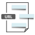

#  Url2Label by word vector APIs MSP Connector

## Description

A generated MSP connector for the Url2Label by word vector APIs API (version 0.0.1).

Generated from: https://api.apis.guru/v2/specs/apitore.com/url2labelByWordVectorApis/0.0.1/swagger.json 
Generated at: 2019-05-07T11:17:09+03:00

## API Description

Url to label by word2vec of contents. [Endpoint] https://api.apitore.com/api/21

## Authorization

This API does not require authorization.

## Actions

### Get labels from URL

> Url2Label by kmeans of word vectors. Response &nbsp; Github: <a href="https://github.com/keigohtr/apitore-response-parent/tree/master/summarize-response">summarize-response</a> &nbsp; Class: com.apitore.banana.response.summarize.LabelResponseEntity 

*Tags:* `url-2-label-by-word-vector-controller`

#### Input Parameters
* `access_token` - _required_ - Access Token
* `url` - _required_ - url
* `num` - _optional_ - num [max 10, default 1]

## License

flowground :- Telekom iPaaS / apitore-com-url-2-label-by-word-vector-apis-connector 
Copyright © 2019, [Deutsche Telekom AG](https://www.telekom.de) 
contact: flowground@telekom.de

All files of this connector are licensed under the Apache 2.0 License. For details
see the file LICENSE on the toplevel directory.
